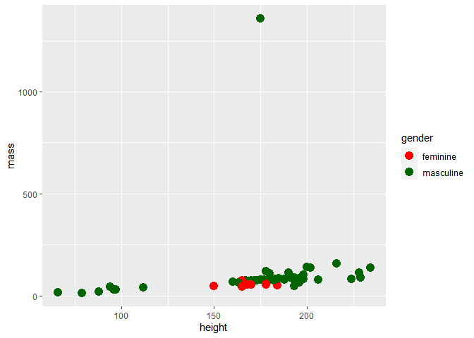
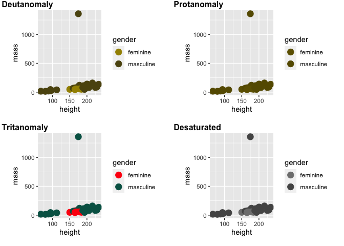

Ra11y: A collection of accessibilty features for ggplot2 charts
================

- [Colour blindness](#colour-blindness)
- [Alt text](#alt-text)
- [Contrast](#contrast)
- [Todo](#todo)

There are a few functions here that I wrote for personal/professional
use. Feel free to use them or [suggest new
ones](https://github.com/nicucalcea/ggspell/issues).

Install like this:

``` r
remotes::install_github("nicucalcea/Ra11y")
```

Then load it.

``` r
library(Ra11y)
```

# Colour blindness

`Ra11y` includes a function that automatically extracts geom `fill` and
`colour` properties and checks if they’re safe to use together. If they
are not, it will print out the possibly unsafe combinations to the
console and suggest a simulation of what the plot looks like with
different types of colour blindness.

Let’s look at an example.

``` r
library(ggplot2)

starwars <- dplyr::starwars |> 
  tidyr::drop_na(height, mass, gender)

starwars_plot <- starwars |>
  ggplot(aes(x = height, y = mass, colour = gender)) +
  geom_point(size = 4) +
  scale_colour_manual(values = c("red", "darkgreen"))

starwars_plot
```

<!-- -->

This chart uses two colours, `red` and `darkgreen`. While those colours
look very distinct to most people, they could look similar for some with
colour blindness, in this case, protanomaly.

Let’s test that theory.

``` r
test_plot(starwars_plot, test = "cvd") # CVD stands for Colour Vision Deficiency
```

    ## 

    ## ── Colour blindness ────────────────────────────────────────────────────────────

    ## ✖ There may be issues with the following colour combinations:

    ## • darkgreen — red

    ## Run `colorblindr::cvd_grid()` for colour-deficiency simulations of your plot.

If you run the suggested command (you’ll need a [separate
package](https://github.com/clauswilke/colorblindr) for that), you can
see exactly where the problem is. The protanomaly version of the chart
has nearly identical colours for both sets of dots.

``` r
colorblindr::cvd_grid(starwars_plot)
```

<!-- -->

You should change the colours to something a bit easier to
differentiate.

Note that the warning is just a suggestions, colours that are deemed
unsafe could be okay to use if, for example, the difference is shown
with another dimension (shape, size, etc). This is just a reminder to
check.

# Alt text

`ggplot2` [has some rudimentary
support](https://github.com/tidyverse/ggplot2/issues/4477) for [alt
text](https://en.wikipedia.org/wiki/Alt_attribute). So far, it gets
automatically embedded in R Markdown (what you’re reading now) and
Quarto documents and outputed to HTML. This function nudges you to add
alt text if you don’t have it, and displays it in the console if you do.

``` r
test_plot(starwars_plot, test = "alt")
```

    ## 

    ## ── Alt text ────────────────────────────────────────────────────────────────────

    ## ✖ Did you forget to include alt text? You can do so in `labs(alt = "This is some text describing the chart.")`.

Let’s add some alt text.

``` r
starwars_plot <- starwars_plot +
  labs(alt = paste0("Scatter plot of Star Wars characters, with height plotted on the x-axis and mass on the y-axis. The dots are coloured by gender. Generally-speaking, height and mass are correlated. The heaviest character is ", starwars$name[starwars$mass == max(starwars$mass)], "."))

test_plot(starwars_plot, test = "alt")
```

    ## 

    ## ── Alt text ────────────────────────────────────────────────────────────────────

    ## ℹ Scatter plot of Star Wars characters, with height plotted on the x-axis and mass on the y-axis. The dots are coloured by gender. Generally-speaking, height and mass are correlated. The heaviest character is Jabba Desilijic Tiure.

My particular use case is to have a reminder to write good, descriptive
alt text for charts that end up being published online.

Of course, you can run both tests in one go.

``` r
test_plot(starwars_plot)
```

    ## 

    ## ── Colour blindness ────────────────────────────────────────────────────────────

    ## ✖ There may be issues with the following colour combinations:

    ## • darkgreen — red

    ## Run `colorblindr::cvd_grid()` for colour-deficiency simulations of your plot.

    ## 

    ## ── Alt text ────────────────────────────────────────────────────────────────────

    ## ℹ Scatter plot of Star Wars characters, with height plotted on the x-axis and mass on the y-axis. The dots are coloured by gender. Generally-speaking, height and mass are correlated. The heaviest character is Jabba Desilijic Tiure.

Additionally, I would recommend checking your plot’s spelling (including
the alt text) with [`ggspell`](https://github.com/nicucalcea/ggspell).

# Contrast

You can use `contrast()` to automatically set the text colour so that
it’s legible on your background.

``` r
contrast("darkred") # returns white
```

    ## [1] "white"

``` r
contrast("yellow", dark_col = "#222222") # returns off-black
```

    ## [1] "#222222"

Or you can use this nifty shortcut.

``` r
grid_data <- expand.grid(X = LETTERS[1:10], Y = paste0("var", seq(1, 10)))
grid_data$Z <- runif(100, 0, 5)

ggplot(grid_data, aes(X, Y, fill = Z)) + 
  geom_tile() +
  geom_text(aes(label = Y, !!!autocontrast))
```

<!-- -->

# Todo

- Check for minimum text size
- Implement a contrast check for plots
