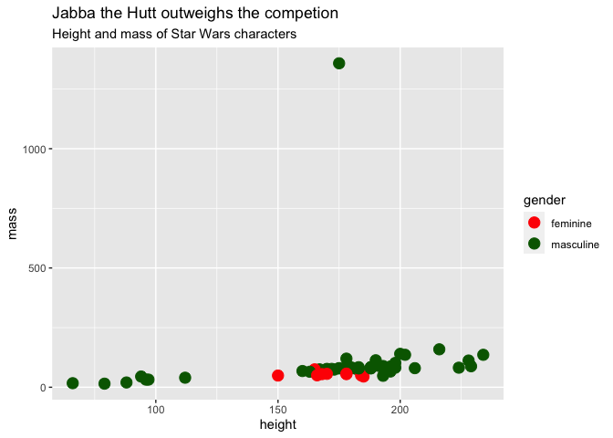
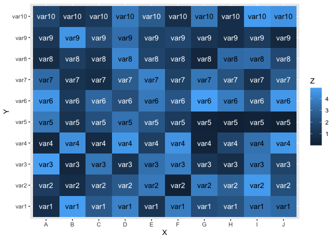

Ra11y: A collection of accessibilty features for ggplot2 charts
================

- [Colour blindness](#colour-blindness)
- [Alt text](#alt-text)
  - [Auto-generating alt text](#auto-generating-alt-text)
- [Contrast](#contrast)
- [Todo](#todo)

There are a few functions here that I wrote for personal/professional
use. Feel free to use them or [suggest new
ones](https://github.com/nicucalcea/ggspell/issues).

Install like this:

``` r
remotes::install_github("nicucalcea/Ra11y")
```

Then load it.

``` r
library(Ra11y)
```

# Colour blindness

`Ra11y` includes a function that automatically extracts geom `fill` and
`colour` properties and checks if they’re safe to use together. If they
are not, it will print out the possibly unsafe combinations to the
console and suggest a simulation of what the plot looks like with
different types of colour blindness.

Let’s look at an example.

``` r
library(ggplot2)

starwars <- dplyr::starwars |> 
  tidyr::drop_na(height, mass, gender)

starwars_plot <- starwars |>
  ggplot(aes(x = height, y = mass, colour = gender)) +
  geom_point(size = 4) +
  scale_colour_manual(values = c("red", "darkgreen")) +
  labs(title = "Jabba the Hutt outweighs the competion",
       subtitle = "Height and mass of Star Wars characters")

starwars_plot
```

<!-- -->

This chart uses two colours, `red` and `darkgreen`. While those colours
look very distinct to most people, they could look similar for some with
colour blindness, in this case, protanomaly.

Let’s test that theory.

``` r
test_plot(starwars_plot, test = "cvd") # CVD stands for Colour Vision Deficiency
```

<!-- --> If you run the
suggested command (you’ll need a [separate
package](https://github.com/clauswilke/colorblindr) for that), you can
see exactly where the problem is. The protanomaly version of the chart
has nearly identical colours for both sets of dots.

``` r
colorblindr::cvd_grid(starwars_plot)
```

<!-- -->

You should change the colours to something a bit easier to
differentiate.

Note that the warning is just a suggestions, colours that are deemed
unsafe could be okay to use if, for example, the difference is shown
with another dimension (shape, size, etc). This is just a reminder to
check.

# Alt text

`ggplot2` [has some rudimentary
support](https://github.com/tidyverse/ggplot2/issues/4477) for [alt
text](https://en.wikipedia.org/wiki/Alt_attribute). So far, it gets
automatically embedded in R Markdown (what you’re reading now) and
Quarto documents and outputed to HTML. This function nudges you to add
alt text if you don’t have it, and displays it in the console if you do.

``` r
test_plot(starwars_plot, test = "alt")
```

<!-- -->

Let’s add some alt text.

``` r
starwars_plot_with_alt <- starwars_plot +
  labs(alt = paste0("Scatter plot of Star Wars characters, with height plotted on the x-axis and mass on the y-axis. The dots are coloured by gender. Generally-speaking, height and mass are correlated. The heaviest character is ", starwars$name[starwars$mass == max(starwars$mass)], "."))

test_plot(starwars_plot_with_alt, test = "alt")
```

<!-- -->

My particular use case is to have a reminder to write good, descriptive
alt text for charts that end up being published online.

Of course, you can run both tests in one go.

``` r
test_plot(starwars_plot_with_alt)
```

<!-- -->

Additionally, I would recommend checking your plot’s spelling (including
the alt text) with [`ggspell`](https://github.com/nicucalcea/ggspell).

## Auto-generating alt text

You can also generate alt text automatically using ✨AI✨.

``` r
alt_text_suggest(starwars_plot)
```

    ## ℹ Scatter plot comparing the height and mass of Star Wars characters, with gender represented by color. Jabba Desilijic Tiure stands out as an outlier with a mass of 1358 and a height of 175.

# Contrast

There are [some
recommendations](https://www.w3.org/WAI/WCAG21/Understanding/contrast-minimum.html)
for setting foreground and background colours that provide enough
contrast with the background. This library includes a function that
checks if two colours are contrasting enough to use together.

``` r
contrast_check("purple", "white")
```

<!-- -->

You can set the colour of text to light or dark depending on, say, the
colour of the background.

You can use `contrast()` to automatically set the text colour so that
it’s legible on your background.

``` r
contrast_bg("darkred") # returns white
```

    ## [1] "white"

``` r
contrast_bg("yellow", dark_col = "#222222") # returns off-black
```

    ## [1] "#222222"

Or you can use this nifty shortcut.

``` r
grid_data <- expand.grid(X = LETTERS[1:10], Y = paste0("var", seq(1, 10)))
grid_data$Z <- runif(100, 0, 5)

ggplot(grid_data, aes(X, Y, fill = Z)) + 
  geom_tile() +
  geom_text(aes(label = Y, !!!autocontrast))
```

<!-- -->

# Todo

- Check for minimum text size
- Implement a [contrast check for
  plots](https://marijohannessen.github.io/color-contrast-checker/).
  Here’s an [example for
  HTML](https://github.com/jasonday/color-contrast) and [one for
  CSS](https://github.com/csstools/postcss-wcag-contrast).
- Check if alt text is too short, too long, doesn’t contain certain
  keywords (chart, graph, graphic, plot, etc.). Perhaps only activated
  with a `strict` param.
- Test other AI models like [VisText](https://github.com/mitvis/vistext)
